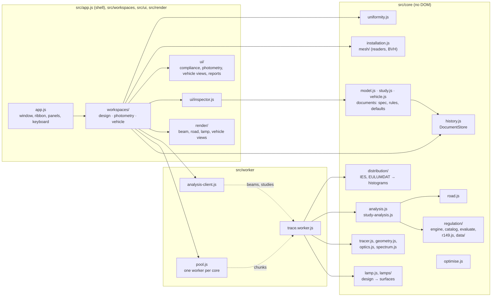

# Architecture

Cutline follows the plan of its sibling apps, KSlides, KDiagram and Linefocus. It uses plain ES modules with no
runtime dependencies, keeps its core logic apart from the browser, stores one versioned document, and ships as a
single offline HTML file.

## Layers

`src/core` never touches the DOM, so the tests run it directly in Node, and the workers and the page share it
unchanged.

## Workspaces

The shell (`app.js`) owns the window: the title bar with the workspace switch, the ribbon, the studies panel, the
dock, the design panel, dialogs, the keyboard, file drops and the viewport's pan and zoom. A **workspace**
(`src/workspaces/workspace.js` defines the contract) owns one document and everything derived from it: its store and
persistence key, its commands and ribbon tabs, its canvas views, its studies, its dock and its design panel
configuration. The shell gives the shared regions to the active workspace; a workspace renders into them only while
it is active, and its commands run only then.

| Workspace | Document | Views | Studies |
|---|---|---|---|
| Lamp design (`design.js`) | `cutline.design` | Beam, road, lamp | Compliance (R149), light budget, road, optimise |
| Photometry (`photometry.js`) | `cutline.photometry` | Beam (cd or lx at 25 m, light or uniformity), road | Markets, your targets, uniformity, road, file |
| Vehicle (`vehicle.js`) | `cutline.vehicle` | 3D (WebGL 2 under a 2D overlay) | Installation (R48, FMVSS 108), lamps, visibility, model |

A file opened or dropped goes to the workspace that reads it: designs to lamp design, IES and EULUMDAT files and
studies to photometry, meshes and vehicles to vehicle. The design workspace hands its traced beam to photometry as an
IES file ("Check every market").

## Sources of truth

Each document holds only the engineer's intent: the design (`model.js`), the photometry study with its file's text
(`study.js`), and the vehicle with its lamps (`vehicle.js`; the model file itself is stored beside it in IndexedDB).
Traces, resampled beams, evaluations, ray-cast visibility, views and panel state are derived and never saved.

Each document's spec is written once in a small schema language (`spec.js`). That one definition drives strict
validation, the published JSON Schemas (`schema.js`, `scripts/build-schema.mjs`), and the design panel's labels, units,
ranges and help text.

The regulations are data apart from the code that checks them. `regulation/r149.js` and `regulation/data/` hold every
requirement with its citation; `regulation/engine.js` measures any requirement kind in an aimed beam;
`regulation/evaluate.js` holds the `Beam` (intensity through a receiver) and R149's aiming and cut-off rules;
`regulation/catalog.js` turns the data into packs with provenance, roles and aiming rules. `installation.js` checks
lamp positions against the R48 and FMVSS 108 installation data. [REGULATION.md](REGULATION.md) describes them.

## Edit pipeline

1. A typed value, a button or a scrubbed label changes the design through `store.transact`, or through
   `store.begin`, `store.preview` and `store.commit` while a label is dragged.
2. The app rebuilds the lamp on the main thread for its section drawing and derived figures, then traces: a preview
   of one million rays at once, then the design's full ray count shortly after the edit settles.
3. `store.commit()` validates the whole design, including the cross-field rules. On failure it restores the snapshot
   and emits `rollback`; the inspector keeps the refused value and its message on screen.
4. A successful commit records leaf patches as one undo command, autosaves to IndexedDB (debounced) and traces again.

## Work off the main thread

One worker script serves two roles.

**The trace pool** (`pool.js`) starts one worker per processor core, less one for the page. A trace is cut into
block-aligned chunks that the workers take in turn, and the results merge into exactly the trace one worker would
have produced: each block of 8,192 rays has its own seed, and a test checks the equality. A newer trace on the same
channel drops the chunks an older one has not started, so a fast edit never queues stale work. Twenty million rays
take about two seconds on a 15-core laptop.

**The analysis worker** (`analysis-client.js`) receives the merged histograms and returns the evaluation, the aimed
beam as candela per bin for drawing, and the road. The evaluation takes a few hundred milliseconds at full quality, too
long for the page's own thread. Requests on a channel replace each other the same way.

The same worker also analyses a **photometry study**: it parses the file, resamples it into far-field histograms
(and, when a market needs the lamp for the other traffic side, its mirror image), aims and evaluates every market,
measures the targets and lights the road. It keeps the resampled file while only the study's other settings change,
so editing a target or a market takes a fraction of a second. The page sends a study again only when something other
than its pictures changed, and compares with the latest request, so an edit undone while its analysis is in flight
still ends with the analysis of the document as it is.

| Channel | Work |
|---|---|
| `design` | The trace and analysis of the design on screen |
| `optimise` | Each optimiser candidate, traced and evaluated without the drawing data |
| `photometry` | The analysis of the photometry study on screen |

The vehicle's checks run on the page: a bounding volume hierarchy (`mesh/bvh.js`) built once per model answers the
visibility rays, and a full check of a dozen lamps takes milliseconds on a simple model and well under a second on a
detailed one.

## Measuring a beam

An imported file is measured the same way: it is resampled into the same two grids, each bin holding the file's
intensity times the bin's solid angle and an infinite ray count, so its statistical error is zero and a bin outside
the file reads as no data (see [PHYSICS.md](PHYSICS.md#imported-light-distributions)).

The tracer bins every ray leaving the lamp into two far-field grids, recording its lumens and counting it. The ray
count gives every measurement its statistical error. The evaluator's `Beam` reads intensity through a receiver of the
regulation's size and widens it only where too few rays arrived. The display uses the same idea with summed-area
tables, so iso-candela lines follow the beam rather than its noise.

## Views

The beam, road and lamp views share one 2D canvas, and only the active view draws. Each owns its camera and draws from
the data it was last given. The beam view shows the beam in the aimed frame, where the regulation's test points are
fixed; its colour scale (log or linear, fitted or fixed, palette, contour levels) and its uniformity map come from the
workspace's display settings. The road view runs the road left to right across the viewport. The vehicle view draws
the model with WebGL 2 on a canvas beneath the 2D canvas, which carries the labels and takes the pointer.

## Single-file build

`build.mjs` inlines the modules into a small `require` registry, embeds the fonts and the stylesheet, and turns the
worker into a Blob URL, so `dist/Cutline.html` runs offline from a file, all three workspaces included. It supports only single-line
`import { … } from '…'` and `export function|class|const|let`, and it rewrites the single
`new Worker(new URL('./worker/trace.worker.js', import.meta.url), { type: 'module' })` in `main.js`.
