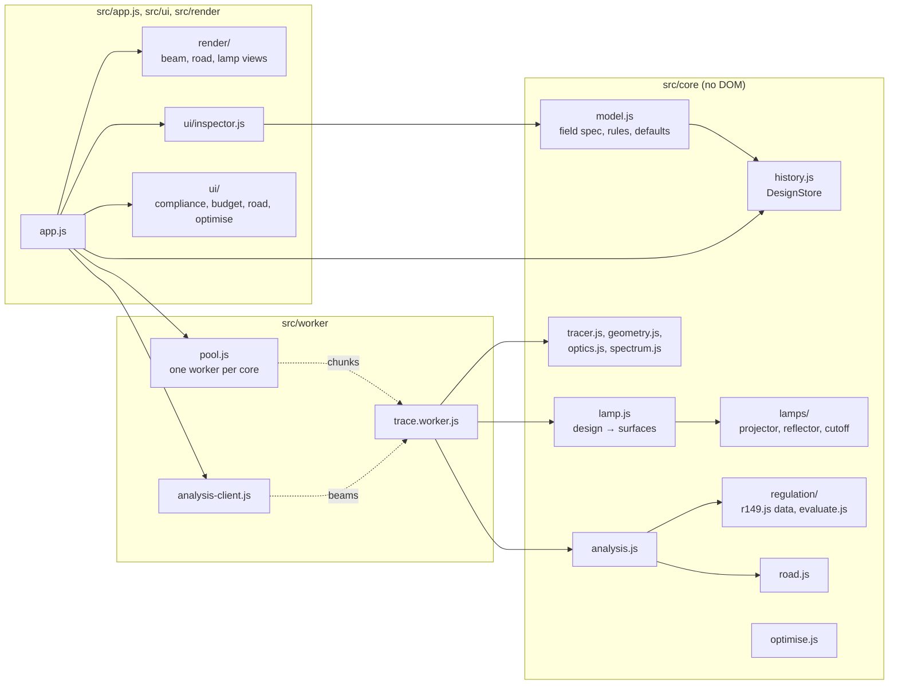

# Architecture

Cutline follows the plan of its sibling apps, KSlides, KDiagram and Linefocus. It uses plain ES modules with no
runtime dependencies, keeps its core logic apart from the browser, stores one versioned document, and ships as a
single offline HTML file.

## Layers

`src/core` never touches the DOM, so the tests run it directly in Node, and the workers and the page share it
unchanged.

## Sources of truth

The design document (`model.js`) holds only the designer's intent. The lamp's surfaces, traces, the evaluation, the
views and panel state are derived and never saved.

`DESIGN_SPEC` in `model.js` is written once in a small schema language (`spec.js`). That one definition drives strict
validation, the published JSON Schema (`schema.js`), and the inspector's labels, units, ranges and help text.

The regulation is data apart from the code that checks it. `regulation/r149.js` lists every requirement with its
citation, and `regulation/evaluate.js` aims the beam the laboratory's way and measures it. [REGULATION.md](REGULATION.md)
describes both.

## Edit pipeline

1. A typed value, a button or a scrubbed label changes the design through `store.transact`, or through
   `store.begin`, `store.preview` and `store.commit` while a label is dragged.
2. The app rebuilds the lamp on the main thread for its section drawing and derived figures, then traces: a preview
   of one million rays at once, then the design's full ray count shortly after the edit settles.
3. `store.commit()` validates the whole design, including the cross-field rules. On failure it restores the snapshot
   and emits `rollback`; the inspector keeps the refused value and its message on screen.
4. A successful commit records leaf patches as one undo command, autosaves to IndexedDB (debounced) and traces again.

## Work off the main thread

One worker script serves two roles.

**The trace pool** (`pool.js`) starts one worker per processor core, less one for the page. A trace is cut into
block-aligned chunks that the workers take in turn, and the results merge into exactly the trace one worker would
have produced: each block of 8,192 rays has its own seed, and a test checks the equality. A newer trace on the same
channel drops the chunks an older one has not started, so a fast edit never queues stale work. Twenty million rays
take about two seconds on a 15-core laptop.

**The analysis worker** (`analysis-client.js`) receives the merged histograms and returns the evaluation, the aimed
beam as candela per bin for drawing, and the road. The evaluation takes a few hundred milliseconds at full quality, too
long for the page's own thread. Requests on a channel replace each other the same way.

| Channel | Work |
|---|---|
| `design` | The trace and analysis of the design on screen |
| `optimise` | Each optimiser candidate, traced and evaluated without the drawing data |

## Measuring a beam

The tracer bins every ray leaving the lamp into two far-field grids, recording its lumens and counting it. The ray
count gives every measurement its statistical error. The evaluator's `Beam` reads intensity through a receiver of the
regulation's size and widens it only where too few rays arrived. The display uses the same idea with summed-area
tables, so iso-candela lines follow the beam rather than its noise.

## Views

The beam, road and lamp views share one canvas, and only the active view draws. Each owns its camera and draws from
the analysis it was last given. The beam view shows the beam in the aimed frame, where the regulation's test points
are fixed, with the intended cut-off moved by the same aim.

## Single-file build

`build.mjs` inlines the modules into a small `require` registry, embeds the fonts and the stylesheet, and turns the
worker into a Blob URL, so `dist/Cutline.html` runs offline from a file. It supports only single-line
`import { … } from '…'` and `export function|class|const|let`, and it rewrites the single
`new Worker(new URL('./worker/trace.worker.js', import.meta.url), { type: 'module' })` in `main.js`.
