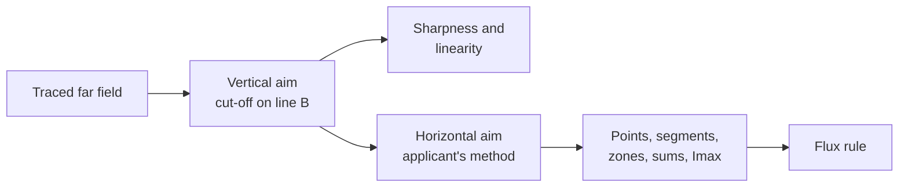

# Regulation

Cutline checks light distributions against the photometric rules of several markets, and lamp positions on a vehicle
against two installation rules. This page says which texts Cutline follows, how it turns each laboratory method into a
calculation, and where it had to choose.

- The **lamp design** workspace checks a traced headlamp against **UN Regulation No. 149, 01 series**. The first part
  of this page describes that check in full.
- The **photometry** workspace checks any light distribution against every market in [Markets](#markets): UN R149 (both
  series), UN R123, UN R148 (both series), FMVSS 108, CMVSS 108, Taiwan's VSTD and India's AIS, and against the
  engineer's own targets.
- The **vehicle** workspace checks where lamps sit against UN R48 and FMVSS 108; see [Installation](#installation).

Every number lives in a data module under `src/core/regulation/` with its citation: `r149.js` for R149 01, and
`data/` for the rest. The research behind each module, with every source, is in `docs/research/`. The engine that
measures requirements is `src/core/regulation/engine.js`; the catalogue that turns the data into markets is
`src/core/regulation/catalog.js`.

Cutline is a design tool. A passing result means the simulated or measured distribution meets the transcribed
type-approval values. It does not replace testing by a technical service.

## UN R149 01 series in the lamp design workspace

### Which text

R149 replaced Regulations 98, 112, 113 and 123 for headlamps in 2019. Its 01 series (in force 4 January 2023)
rewrote the classes and tables. Since 1 September 2026, countries need not accept 00-series approvals first issued
after that date (01 series §7.2.2), so a new design should meet the 01 series. Cutline checks only the 01 series.

| Beam | Class | Symbol | Use |
|---|---|---|---|
| Passing (low) | C | C | A normal car low beam |
| Passing (low) | V | V | A lower-output low beam |
| Driving (high) | B | HR | A normal car high beam |
| Driving (high) | A | R | A lower-output high beam |

The 00 series used "C" for its Class A passing beam. In the 01 series "C" means Class C.

### Sources

The regulation's own website blocks automated downloads, so the text comes from the UN Official Document System, which
holds the same documents WP.29 adopted:

| Document | What it is |
|---|---|
| [ECE/TRANS/WP.29/2022/93](https://documents.un.org/api/symbol/access?s=ECE/TRANS/WP.29/2022/93&l=en&t=pdf) | The full 01 series text |
| [ECE/TRANS/WP.29/1166](https://documents.un.org/api/symbol/access?s=ECE/TRANS/WP.29/1166&l=en&t=pdf), para. 143 | Corrections made when WP.29 adopted it |
| Supplements 1–7 (WP.29/2023/38 to WP.29/2026/35) | Later amendments. Supplement 3 moved the run-up check point, Supplement 4 required linearity to be measured at 25 m, and Supplement 7 set the scan step to 0.05° or smaller; none changes a limit Cutline checks |

One correction matters. As printed, the Class V limit for "Segment 10 and below" is 0.8 × the value at 50R. The
correction reads 0.8 × the value at 25V, and Cutline uses 25V. For Class C it stays 50R.

Table 6 (passing beam), Table 5 (driving beam), the Zone III polygon, the overhead sign points and the Annex 6
sharpness rule were checked line by line against the official PDF. Page numbers in the citations are the document's
own. The full research notes, including the open questions, are in [research/r149-notes.md](research/r149-notes.md).
Before relying on a result, confirm against the current consolidated text from UNECE (Revision 1 and its amendments),
which this project could not fetch.

### How a beam is checked

The regulation measures a lamp after the laboratory has aimed it, so Cutline aims first and measures second. Every
value below is measured in the aimed beam.

**Vertical aim (passing beam).** Cutline scans upwards at 2.5° on the driver's side of V-V (left for right-hand
traffic), in steps of 0.05° (the largest step Supplement 7 allows), and finds the steepest fall of log intensity, G = log I(β) − log I(β + 0.1°). The
inflection point there is moved to line B, 0.57° below the horizon (Annex 5 §3.2.1.1, Annex 6 §2.3.1).

**Sharpness and linearity.** In the aimed beam, the largest G on the 2.5° scan must lie between 0.13 and 0.40 (Annex 6
§2.2.2). The inflection points at 1.5°, 2.5° and 3.5° must lie within 0.2° of each other vertically (Annex 6
§2.2.3.1).

**Horizontal aim (passing beam).** The applicant chooses the method, and so does the design (`cutoff.aimMethod`):

- **0.2°D line**, method (a): scan the line 0.2° below the horizon from 5°L to 5°R. The steepest fall, with G at
  least 0.08, goes onto line A at 0.5°R.
- **Three lines**, method (b): scan vertically at 1°R, 2°R and 3°R, each with G at least 0.08. A straight line through
  the three inflection points meets line B, and that meeting point goes onto V-V.

**Driving beam.** The area of maximum intensity is centred on H-V (Annex 5 §3.1.2). A driving beam that shares its
aim with the passing beam is not modelled.

**Measurement.** Each value is what the regulation's receiver reads: a 65 mm square at 25 m, about 0.149° across
(Annex 4 §1.1.1). [PHYSICS.md](PHYSICS.md#far-field-angles) explains how Cutline widens the averaging area where
too few rays arrive, and the statistical error this leaves on each value.

| Requirement | How Cutline measures it |
|---|---|
| Point | The receiver at the point |
| Segment | The receiver every 0.1° along the line; the weakest position for a minimum, the brightest for a maximum |
| Zone | The receiver on a 0.1° × 0.05° lattice inside the polygon; the brightest position |
| Sum (overhead signs) | The receiver at each point, added |
| Segment 10 and below | The brightest receiver position from 4°D down to 30°D between 4.5°L and 2°R, against 0.8 × 50R (Class C) or 0.8 × 25V (Class V) |
| Imax | The brightest receiver position in the beam |
| H-V of a driving beam | At least 0.8 × Imax |
| Minimum flux | 1,000 lm of LED flux, or at least 400 lm in Zone I (30°L–30°R, 15°D–1°U) and 200 lm in Zone II (30°L–30°R, 3.5°D–1°U) of the aimed beam (§4.5.3.2, Tables 3a and 3b) |

**Left-hand traffic.** Every horizontal coordinate is mirrored about V-V, and names swap L and R: B50L becomes B50R,
75R becomes 75L (Annex 4, p. 61).

### Results

Each requirement gets a **margin**, its relative headroom: (value − minimum) / minimum, or (maximum − value) /
maximum. A negative margin fails.

| Status | Meaning |
|---|---|
| Pass | Margin above 10% and above twice the value's statistical error |
| Near | Passes, but within 10% of the limit or within twice the statistical error |
| Fail | Margin below zero |
| Blocked | A relative requirement whose reference fails; "Segment 10 and below" cannot be judged while 50R fails |
| No data | The requirement lies outside the angles an imported file covers (photometry workspace only) |
| Listed | A rule Cutline lists but cannot judge from a light distribution, such as colour |

### Choices and open questions

These are places where the regulation leaves room, or where a calculation has to stand in for a laboratory.

- **Coordinate tolerance.** §5.1.3 allows a 0.25° tolerance at each test point, but it sits in the driving-beam
  section, and the passing-beam section has no such sentence. Cutline applies it to driving beams only. It searches
  for the most favourable value within 0.25° of each driving-beam point. Passing-beam points are measured exactly
  where the table puts them, which is the stricter reading.
- **The steepest G and the inflection point.** The text defines G but does not say whether the limits apply to its
  largest value along the scan. Cutline uses the largest value, the reading that matches "maximum gradient" in the
  horizontal methods. A softened cut-off does not have a single sharp maximum of G: its log intensity falls at an
  almost steady rate over a few tenths of a degree, so G has a broad, flat top. The regulation defines the inflection
  point as where the second derivative of log E is zero, which on such a stretch is not one point, and a laboratory
  would face the same ambiguity. Cutline therefore:
  - counts a scan cell only when at least 100 rays reach it;
  - averages each G with its neighbours, so a single noisy pair of cells cannot pose as the cut-off;
  - takes the size of the steepest fall from a parabola through the largest G and its neighbours;
  - places the inflection point at the centre of the peak: with G averaged over ±0.1°, the G-weighted middle of the
    stretch around the maximum where G stays above 70% of it. For a sharp, symmetric peak this is the maximum itself.

  The result is an aim that holds still as rays are added and between random seeds. At 20 million rays the default
  projector's vertical aim varies by under 0.01° between seeds, and its sideways aim by about 0.03°.
- **Scan width.** The regulation's detector for sharpness is about 30 mm at 25 m (0.07°). Cutline's vertical scans
  average over 0.05° vertically and, to gather enough rays, ±0.5° horizontally on the flat part of the cut-off (level
  from 1.5° to 3.5° by the linearity rule) and ±0.2° on the rising part. The horizontal scan along 0.2°D averages
  0.15° along the line.
- **Segment and zone sampling.** The regulation gives no step. Cutline uses 0.1° along segments and a 0.1° × 0.05°
  lattice in zones. Their value is the weakest or brightest position, and an extreme of noisy values is biased by the
  noise, so each position rests on at least 400 rays rather than 100. Where fewer reach the receiver, it widens and
  averages over sharp peaks, so a zone's maximum reads low until the trace has enough rays, then settles. Judge a
  design at the full trace (20 million rays by default), not the quick preview; for faint glare zones, 50 million
  rays (Fine quality) settles the value further.
- **Type approval only.** Cutline checks the type-approval values. It does not apply the conformity-of-production
  allowances (§6.2) or the matched-pair rules (Annex 4 §1.5), and it does not check colour, run-up time, the
  rear-light limit or bend lighting.
- **Installation.** Mounting height and aim on the vehicle are governed by UN Regulation No. 48, which Cutline does
  not check. The road view uses them only to show where the light lands.
- **The 15° rise.** R149 requires an elbow-shoulder cut-off with a sharp edge but does not prescribe its angle. The
  15° rise is common practice and a design value in Cutline.
- **Open items from the research.** The full list of corrections in WP.29-187-05 beyond those in WP.29/1166, and the
  date Supplement 7 entered into force, could not be confirmed.

## Markets

A **pack** is one regulation's requirements as data, with its provenance, the lamp roles each function serves and the
aiming rule each is measured after. A **market** is one pack function under one traffic side. The photometry
workspace starts with the usual function of every pack that serves the lamp's role, for each traffic side the pack
covers, and the engineer adds or removes markets.

| Pack | Text | Provenance | Aiming before measurement | Research |
|---|---|---|---|---|
| UN R149 | 01 series, Classes C, V (passing), B, A (driving) | Official | R149's own evaluator, as above | [r149-notes.md](research/r149-notes.md) |
| UN R149 00 | 00 series to Supplement 10, Classes A, B, D and the driving beams; L-category symmetric classes listed but not offered by role | Official, not checked by default | Passing: the same instrumental method as 01 (Annex 5 §2), with the 00 series' citations. Driving: maximum on H-V. No coordinate tolerance (Tables 5 and 8 print none) | [r149-00-notes.md](research/r149-00-notes.md) |
| UN R123 | 01 and 02 series (AFS), every class, bending and adaptive state | Official; R123 grants no new approvals | Class C: the R149 instrumental method, which R123 Annex 8 shares, with R123's citations. Other modes keep the Class C or driving-beam aim, so their own file is taken as measured. Driving: maximum on H-V. R123 values apply to half the sum of both sides of the system (Annex 9 §1.8); Cutline takes the file as that half-sum and does not judge the one-side rules of Annex 9 §1.8.1 apart | [r123-notes.md](research/r123-notes.md) |
| UN R148 | 01 series to Supplement 6, every signal function and category | Official | None: the file's reference axis | [r148-notes.md](research/r148-notes.md) |
| UN R148 00 | Original series to Supplement 6 | Official, not checked by default | None | [r148-00-notes.md](research/r148-00-notes.md) |
| FMVSS 108 | 49 CFR 571.108, headlamp Tables XVIII and XIX, signal Tables VI to XV | Official | Visually aimed lower beams: the cut-off's steepest gradient, scanned at 2.5°L (VOL) or 2°R (VOR), goes to 0.4°D or onto H-H, with no horizontal aim (S14.2.5.5.3); the cut-off's gradient must reach 0.13. Mechanically aimed beams and signal lamps: the file's axis | [fmvss108-cmvss108-headlamps-notes.md](research/fmvss108-cmvss108-headlamps-notes.md), [fmvss108-signal-installation-notes.md](research/fmvss108-signal-installation-notes.md) |
| CMVSS 108 | TSD 108 Revision 8 | Adopted: FMVSS 108's data, with Canada's differences and accepted UN alternatives listed | As FMVSS 108 | as FMVSS 108 |
| Taiwan VSTD items 92, 92-1, 91, 91-1 | 92 and 91 adopt R149 00 and R148 00 (new types from 2025); 92-1 and 91-1 adopt R149 01 and R148 01 (new types from 2028) | Adopted | As the UN series adopted | [national-notes.md](research/national-notes.md) |
| India AIS-199, AIS-198 | Drafts adopting R149 00 (left-hand traffic) and R148 00, adopted by CMVR-TSC in 2024; notification not found | Adopted | As the UN series adopted | [national-notes.md](research/national-notes.md) |

**Provenance** is shown with every result and in the report. *Official*: transcribed from the official text, every
value cited. *Adopted*: the national text adopts another regulation, and Cutline checks that regulation's data,
naming the series and listing the national differences it knows. Cutline never fills a value from memory: a market
whose basis it cannot establish from an official source, or whose basis it does not hold, is listed as not checked.

**Not checked.** China's GB 4599-2024 (headlamps) and GB 5920-2024 (signal lamps), in force since 1 July 2025: their
forewords, which state any UN basis, could not be read from an official source, so their basis is unknown. India's
AIS-010 (headlamps, based on R112, R113 and R98) and AIS-012 (signal lamps): Cutline does not hold those UN texts. The
photometry workspace's market dialog and the report list these with their reasons.

### How the engine measures

Each requirement is one of a few kinds, measured in the aimed beam through the regulation's receiver (R149's, 0.149°
across, for every pack: FMVSS allows a sensor up to about 0.52° across, and a smaller one is within its rule):

| Kind | Measured |
|---|---|
| Point | The receiver at the point; with a coordinate tolerance, the most favourable value within it |
| Line | The receiver every 0.1° along it (0.5° outside the fine grid); the weakest position for a minimum, the brightest for a maximum |
| Zone | The receiver on a 0.1° × 0.05° lattice inside the polygon (0.5° × 0.25° outside the fine grid): everywhere, or its brightest position when the text sets a minimum for the zone's maximum |
| Sum | The receiver at each point, added |
| Relative | A limit of a factor times another requirement's value or Imax; blocked while that requirement fails |
| Imax | The brightest receiver position, leaving out any zone with its own maximum; spots smaller than a stated cone are smoothed away |
| Standard light distribution | Each grid point against its percentage of the reference minimum; with R148's rule, every direction in the grid against the lowest minimum at the corners of its cell |
| Note | Listed, not judged: colour, timing, failure modes and other rules that a light distribution cannot show |

**Conditions.** Some requirements apply only to some lamps: mounted below 750 mm, marked "D", combined with another
function, day or night, narrow or wide vehicle. Each pack lists its conditions; the engineer ticks those that hold for
the lamp, and a conditional requirement then applies, replacing its unconditional counterpart where the text says so.
An adopted pack shares its basis's conditions, so a fact ticked for UN R148 also holds for Taiwan's item 91-1. For a
visually aimed FMVSS lower beam the engineer also ticks which side its cut-off is on, VOL (the default) or VOR, which
decides where the aim puts it.
FMVSS signal tables add two point rules: in Tables VI, VII, IX, XIII-a and XV every group total must pass and each point
needs only 60% of its minimum; in Tables VIII, XII and XIV a point below its minimum passes when its group total does.
FMVSS lines printed as "to L" or "to R" run to 90° on that side.

**Traffic sides.** Headlamp data is written for right-hand traffic; for left-hand traffic every horizontal coordinate
is mirrored and L and R swap in names (R149 Annex 4, R123 §5.1). A headlamp file is made for one side. For a market
on the other side, Cutline checks the file's mirror image, as the other side's lamp usually is, unless the engineer
says the lamp serves both sides. Signal lamp data is written with H positive outwards; the engineer says which side of
the file faces outwards.

**Targets.** The engineer's own targets (points, lines and areas, as minima, maxima or ranges, in cd or lx at 25 m) are
measured by the same engine in the beam as pictured: aimed as the first market aims it, or as measured.

## Installation

The vehicle workspace checks each placed lamp against UN R48 (09 series to Supplement 3; [r48-notes.md](research/r48-notes.md))
and FMVSS 108 Table I-a with its visibility rules ([fmvss108-signal-installation-notes.md](research/fmvss108-signal-installation-notes.md)).
The data is in `src/core/regulation/data/r48.js` and `data/fmvss108-installation.js`; the checker is
`src/core/installation.js`. [PHYSICS.md](PHYSICS.md#the-vehicle) describes the vehicle frame and the ray casting.

| Check | UN R48 | FMVSS 108 |
|---|---|---|
| Presence | Mandatory devices for the vehicle category that are not placed fail | Mandatory devices for the vehicle type; front and rear side markers are separate rows of Table I-a, so they are placed as separate functions |
| Number | The count's minimum and maximum, by category where given | Table I-a |
| Height | Lowest edge of the apparent surface against the minimum, highest edge against the maximum (§5.8); a higher alternative allowed "if the bodywork does not permit" is reported as near, with its condition | The lamp's centre (S6.1.4) |
| Width | Outer edge of the apparent surface to the vehicle's outer edge (§5.8.3); a centred lamp's offset from the median plane | No distance from the edge is set |
| Separation | Inner edges of a pair, unless the category is exempt; the narrow-vehicle value below its width | – |
| Visibility | The field's angles, with the reductions below 750 mm (5° down, 20° inwards below the H plane) and above 2,100 mm. §5.28.1: no part of the apparent surface may be hidden; a hidden share fails, with the §5.28.3 note that a hidden part needs photometric proof | 1,250 mm² of the apparent surface unobstructed throughout the field |

Rules that depend on parts Cutline does not identify on the model (the high-mounted stop lamp against the rear window,
lamps above or below other lamps, side-marker spacing, no direct view from a zone) are listed to be checked by hand,
never dropped. Colour, activation and electrical rules are outside this check.

## Changing the regulation data

Every value comes from an official text fetched and read, never from memory. Edit the pack's data module
(`src/core/regulation/r149.js`, or a module in `src/core/regulation/data/`), give every new entry its citation with
the page number as the document prints it, and record the source and any choice in the pack's research notes. If a
supplement changes a value, say so in the notes and in the citation. `npm test` checks that every requirement cites
its source, that every condition and replacement refers to something that exists, and that a sample of transcribed
values stays as printed. A new pack is added to `catalog.js` with its provenance, roles and aiming rule, and to the
table above.
