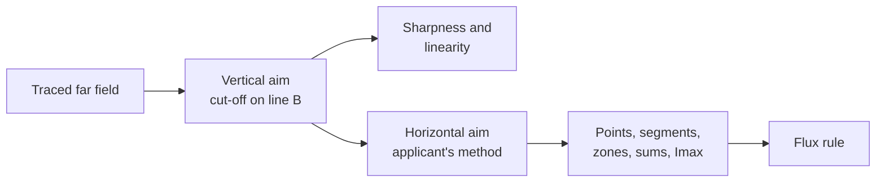

# Regulation

Cutline checks a beam against **UN Regulation No. 149, 01 series of amendments**: the photometric requirements for
headlamps that UNECE countries, the EU, Japan and others apply at type approval. This page says which text Cutline
follows, how it turns the regulation's laboratory method into a calculation, and where it had to choose. The
requirements themselves are data in `src/core/regulation/r149.js`, and every entry there cites its table or paragraph.
The evaluator is `src/core/regulation/evaluate.js`.

Cutline is a design tool. A passing result means the simulated design meets the type-approval values. It does not
replace testing by a technical service.

## Which text

R149 replaced Regulations 98, 112, 113 and 123 for headlamps in 2019. Its 01 series (in force 4 January 2023)
rewrote the classes and tables. Since 1 September 2026, countries need not accept 00-series approvals first issued
after that date (01 series §7.2.2), so a new design should meet the 01 series. Cutline checks only the 01 series.

| Beam | Class | Symbol | Use |
|---|---|---|---|
| Passing (low) | C | C | A normal car low beam |
| Passing (low) | V | V | A lower-output low beam |
| Driving (high) | B | HR | A normal car high beam |
| Driving (high) | A | R | A lower-output high beam |

The 00 series used "C" for its Class A passing beam. In the 01 series "C" means Class C.

## Sources

The regulation's own website blocks automated downloads, so the text comes from the UN Official Document System, which
holds the same documents WP.29 adopted:

| Document | What it is |
|---|---|
| [ECE/TRANS/WP.29/2022/93](https://documents.un.org/api/symbol/access?s=ECE/TRANS/WP.29/2022/93&l=en&t=pdf) | The full 01 series text |
| [ECE/TRANS/WP.29/1166](https://documents.un.org/api/symbol/access?s=ECE/TRANS/WP.29/1166&l=en&t=pdf), para. 143 | Corrections made when WP.29 adopted it |
| Supplements 1–7 (WP.29/2023/38 to WP.29/2026/35) | Later amendments. Supplement 3 moved the run-up check point, Supplement 4 required linearity to be measured at 25 m, and Supplement 7 set the scan step to 0.05° or smaller; none changes a limit Cutline checks |

One correction matters. As printed, the Class V limit for "Segment 10 and below" is 0.8 × the value at 50R. The
correction reads 0.8 × the value at 25V, and Cutline uses 25V. For Class C it stays 50R.

Table 6 (passing beam), Table 5 (driving beam), the Zone III polygon, the overhead sign points and the Annex 6
sharpness rule were checked line by line against the official PDF. Page numbers in the citations are the document's
own. The full research notes, including the open questions, are in [research/r149-notes.md](research/r149-notes.md).
Before relying on a result, confirm against the current consolidated text from UNECE (Revision 1 and its amendments),
which this project could not fetch.

## How a beam is checked

The regulation measures a lamp after the laboratory has aimed it, so Cutline aims first and measures second. Every
value below is measured in the aimed beam.

**Vertical aim (passing beam).** Cutline scans upwards at 2.5° on the driver's side of V-V (left for right-hand
traffic), in steps of 0.05° (the largest step Supplement 7 allows), and finds the steepest fall of log intensity, G = log I(β) − log I(β + 0.1°). The
inflection point there is moved to line B, 0.57° below the horizon (Annex 5 §3.2.1.1, Annex 6 §2.3.1).

**Sharpness and linearity.** In the aimed beam, the largest G on the 2.5° scan must lie between 0.13 and 0.40 (Annex 6
§2.2.2). The inflection points at 1.5°, 2.5° and 3.5° must lie within 0.2° of each other vertically (Annex 6
§2.2.3.1).

**Horizontal aim (passing beam).** The applicant chooses the method, and so does the design (`cutoff.aimMethod`):

- **0.2°D line**, method (a): scan the line 0.2° below the horizon from 5°L to 5°R. The steepest fall, with G at
  least 0.08, goes onto line A at 0.5°R.
- **Three lines**, method (b): scan vertically at 1°R, 2°R and 3°R, each with G at least 0.08. A straight line through
  the three inflection points meets line B, and that meeting point goes onto V-V.

**Driving beam.** The area of maximum intensity is centred on H-V (Annex 5 §3.1.2). A driving beam that shares its
aim with the passing beam is not modelled.

**Measurement.** Each value is what the regulation's receiver reads: a 65 mm square at 25 m, about 0.149° across
(Annex 4 §1.1.1). [PHYSICS.md](PHYSICS.md#far-field-angles) explains how Cutline widens the averaging area where
too few rays arrive, and the statistical error this leaves on each value.

| Requirement | How Cutline measures it |
|---|---|
| Point | The receiver at the point |
| Segment | The receiver every 0.1° along the line; the weakest position for a minimum, the brightest for a maximum |
| Zone | The receiver on a 0.1° × 0.05° lattice inside the polygon; the brightest position |
| Sum (overhead signs) | The receiver at each point, added |
| Segment 10 and below | The brightest receiver position from 4°D down to 30°D between 4.5°L and 2°R, against 0.8 × 50R (Class C) or 0.8 × 25V (Class V) |
| Imax | The brightest receiver position in the beam |
| H-V of a driving beam | At least 0.8 × Imax |
| Minimum flux | 1,000 lm of LED flux, or at least 400 lm in Zone I (30°L–30°R, 15°D–1°U) and 200 lm in Zone II (30°L–30°R, 3.5°D–1°U) of the aimed beam (§4.5.3.2, Tables 3a and 3b) |

**Left-hand traffic.** Every horizontal coordinate is mirrored about V-V, and names swap L and R: B50L becomes B50R,
75R becomes 75L (Annex 4, p. 61).

## Results

Each requirement gets a **margin**, its relative headroom: (value − minimum) / minimum, or (maximum − value) /
maximum. A negative margin fails.

| Status | Meaning |
|---|---|
| Pass | Margin above 10% and above twice the value's statistical error |
| Near | Passes, but within 10% of the limit or within twice the statistical error |
| Fail | Margin below zero |
| Blocked | A relative requirement whose reference fails; "Segment 10 and below" cannot be judged while 50R fails |

## Choices and open questions

These are places where the regulation leaves room, or where a calculation has to stand in for a laboratory.

- **Coordinate tolerance.** §5.1.3 allows a 0.25° tolerance at each test point, but it sits in the driving-beam
  section, and the passing-beam section has no such sentence. Cutline applies it to driving beams only. It searches
  for the most favourable value within 0.25° of each driving-beam point. Passing-beam points are measured exactly
  where the table puts them, which is the stricter reading.
- **The steepest G and the inflection point.** The text defines G but does not say whether the limits apply to its
  largest value along the scan. Cutline uses the largest value, the reading that matches "maximum gradient" in the
  horizontal methods. A softened cut-off does not have a single sharp maximum of G: its log intensity falls at an
  almost steady rate over a few tenths of a degree, so G has a broad, flat top. The regulation defines the inflection
  point as where the second derivative of log E is zero, which on such a stretch is not one point, and a laboratory
  would face the same ambiguity. Cutline therefore:
  - counts a scan cell only when at least 100 rays reach it;
  - averages each G with its neighbours, so a single noisy pair of cells cannot pose as the cut-off;
  - takes the size of the steepest fall from a parabola through the largest G and its neighbours;
  - places the inflection point at the centre of the peak: with G averaged over ±0.1°, the G-weighted middle of the
    stretch around the maximum where G stays above 70% of it. For a sharp, symmetric peak this is the maximum itself.

  The result is an aim that holds still as rays are added and between random seeds. At 20 million rays the default
  projector's vertical aim varies by under 0.01° between seeds, and its sideways aim by about 0.03°.
- **Scan width.** The regulation's detector for sharpness is about 30 mm at 25 m (0.07°). Cutline's vertical scans
  average over 0.05° vertically and, to gather enough rays, ±0.5° horizontally on the flat part of the cut-off (level
  from 1.5° to 3.5° by the linearity rule) and ±0.2° on the rising part. The horizontal scan along 0.2°D averages
  0.15° along the line.
- **Segment and zone sampling.** The regulation gives no step. Cutline uses 0.1° along segments and a 0.1° × 0.05°
  lattice in zones. Their value is the weakest or brightest position, and an extreme of noisy values is biased by the
  noise, so each position rests on at least 400 rays rather than 100. Where fewer reach the receiver, it widens and
  averages over sharp peaks, so a zone's maximum reads low until the trace has enough rays, then settles. Judge a
  design at the full trace (20 million rays by default), not the quick preview; for faint glare zones, 50 million
  rays (Fine quality) settles the value further.
- **Type approval only.** Cutline checks the type-approval values. It does not apply the conformity-of-production
  allowances (§6.2) or the matched-pair rules (Annex 4 §1.5), and it does not check colour, run-up time, the
  rear-light limit or bend lighting.
- **Installation.** Mounting height and aim on the vehicle are governed by UN Regulation No. 48, which Cutline does
  not check. The road view uses them only to show where the light lands.
- **The 15° rise.** R149 requires an elbow-shoulder cut-off with a sharp edge but does not prescribe its angle. The
  15° rise is common practice and a design value in Cutline.
- **Open items from the research.** The full list of corrections in WP.29-187-05 beyond those in WP.29/1166, and the
  date Supplement 7 entered into force, could not be confirmed.

## Changing the regulation data

Edit `src/core/regulation/r149.js`, give every new entry its citation, and keep page numbers as the document prints
them. `npm test` checks that every requirement cites the official text. If a supplement changes a value, say so here
and in the citation.
