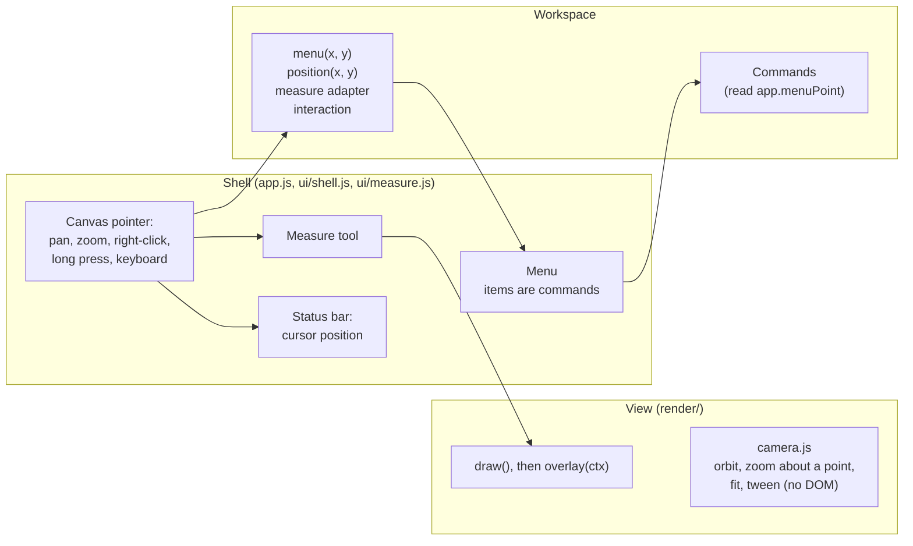

# Design: working on the canvas

This page records how Cutline's canvas became a place to work, the way a CAD tool's viewport is, and why it is built
the way it is. [ARCHITECTURE.md](../ARCHITECTURE.md) describes the code as it stands; this page explains the decisions.

## What was asked

Make the canvas feel like a professional CAD tool: context menus where they help, and the other improvements an
engineer expects but did not list.

Before this work the canvas could only be looked at. Every view panned and zoomed, and the vehicle view selected a lamp
on click, but every action lived in the ribbon or the design panel. A right-click did nothing useful. The 3D view
zoomed towards its centre whatever the pointer pointed at, orbited about a fixed point, and jumped between standard
views. A lamp could be moved only by "Place again" and a click, and a regulation dimension, such as a lamp's height
above the ground, could be read only in the table.

## Principles

1. **Point at a thing, act on it.** Every object on the canvas answers a right-click with the commands that apply to
   it, and every command a menu offers is also in the ribbon or the command palette, so nothing is hidden in a menu.
2. **Move things directly.** A lamp is dragged across the model, and the regulation's measures follow it as it moves.
3. **The camera goes where the pointer is.** Zoom towards the point under the pointer, orbit about the point under the
   pointer, and move smoothly between standard views.
4. **Show the measure the regulation takes.** The selected lamp's heights, distance from the outer edge and
   separation are drawn on the model as dimension lines, coloured by their result.
5. **Every edit goes through the store.** A drag or a held arrow key is one undo step, validated on release.
6. **Everything has a keyboard path**, and the touch screen gets a long press for the menu.

## Shape of the solution

### Context menus

The shell owns one `Menu` (in `ui/shell.js`, beside the dialogs and toasts). A workspace gives it the entries for a
point on the canvas through `menu(x, y)`. An entry is a registered command, a heading, a separator or a submenu.
Menu items are `[data-cmd]` buttons for registered commands, so a command's enabled and pressed states, icon and
shortcut come with it. The menu's own delegated listener runs the chosen command and then closes the menu.

A command that acts on a place, such as "Add a lamp here" or "Add a target here", reads `app.menuPoint`, the canvas
point the menu was opened at. The menu starts the command before it closes, and closing clears the point, so a
command that waits (for a dialog, say) reads the point when it starts. Such a command is
enabled only while `menuPoint` is set, so it never appears in the command palette, where it would have no place to
act on.

| Opened by | Where the menu appears |
|---|---|
| Right-click that does not drag (a right drag still moves the view) | At the pointer |
| Ctrl-click on a Mac | At the pointer |
| A long press on a touch screen (550 ms, moving less than 6 px) | At the finger |
| The Menu key, or Shift+F10 | At the selection, or the middle of the view |

The menu is navigated with the arrow keys, Home and End, Enter, and the first letter of an item. The right arrow
opens a submenu and the left arrow closes it. Escape, a click elsewhere, the wheel, a resize or a change of workspace
closes it. It flips to stay inside the window.

| Workspace and view | On an object | Anywhere |
|---|---|---|
| Vehicle, on a lamp | Zoom to the lamp, look along its axis, show its visibility, place again, mirror, remove, copy its position, measure from its centre | |
| Vehicle, on the model | Add a lamp here (every function, under front, side and rear), centre here (the camera then turns about it), measure from here, copy the position | |
| Vehicle, empty space | | Fit, standard views, orthographic, see-through body, dimensions, visibility fields, add a lamp |
| Beam (both workspaces), on a test point, line or zone | Show it in the table | Centre here, copy the direction, measure from here, fit, contour lines, image of the view |
| Photometry beam | | Add a target here, colour by uniformity |
| Road and lamp views | | Centre here, copy the position, measure from here, fit, image of the view |

### The 3D camera

The camera maths lives in `render/camera.js`, which has no DOM, so Node tests check its promises:

- **Zoom about a point.** The wheel scales the eye and the target about the model point under the pointer, or the
  point on the target's plane when the pointer is off the model. That point stays where it is on the screen.
- **Orbit about a point.** A drag turns the camera about the model point it started on, and a dot marks that point
  while it turns. The point stays where it is on the screen.
- **Smooth standard views.** Fit, the standard views, zoom to a lamp and look along its axis move the camera over
  280 ms, the yaw taking the short way round. With reduced motion asked for, the camera moves at once. The report's
  pictures are drawn without the motion.
- **View cube.** A cube in the top right turns with the model, labelled front, rear, left, right, top and bottom in
  the vehicle's frame. Clicking a face moves to that standard view; the face under the pointer lights up.
- **Axes.** A small triad in the bottom right shows x forwards, y to the left and z up, the frame every position is
  given in.
- **Scale bar in orthographic view.** Lengths read true only without perspective, so the scale bar shows then.

### Lamps on the model

The vehicle workspace has one mode field: none, placing a lamp, moving a lamp, or measuring. The mode drives the
cursor and the status bar hint, and Escape leaves any mode.

- **Picking a lamp** casts the pointer's ray against each lamp's apparent surface, a rectangle in 3D, and ignores a
  lamp hidden behind bodywork (unless the body is see-through). The same test serves the hover highlight, a click
  and the start of a drag.
- **Hover and selection.** The lamp under the pointer gets a thin outline and the selected lamp a thick white one,
  drawn on the 2D overlay so they keep their width at any zoom. A lamp behind bodywork keeps its name hidden, and a
  name or dimension value that would cover another label is left out, so the view stays readable when zoomed out.
- **Dragging a lamp** moves its centre of reference across the model surface under the pointer, through
  `store.begin`, `store.preview` and `store.commit`, so the checks update as it moves and the drag is one undo step.
  A side lamp turns to face the side it is on. Escape during the drag puts the lamp back. Near its twin's mirror
  image the lamp snaps to it and the status bar says so; Alt turns snapping off. With Shift held the twin moves too,
  mirrored.
- **Arrow keys** nudge the selected lamp by 1 mm (10 mm with Shift) along the vehicle axis nearest the arrow's
  direction on screen. Holding an arrow is one undo step.
- **Dimension lines.** For the selected lamp the view draws each height, outer edge and median plane measure, and its
  pair's separation, as a dimension line with extension lines, the value and the result's colour. They come from
  the installation results, so they are the numbers the table shows. They appear once the lamp is large enough on
  screen to read them.
- **See-through body** draws the model translucent, so a lamp on the far side can be seen and picked.

### The measure tool

The measure tool (D, or the ribbon's View tab in every workspace) belongs to the shell. A workspace gives it an
adapter: the point under the pointer (snapped to a lamp centre or a test point when close), where a point is now on
the screen, and the text that describes two points. The shell draws the measurement through each view's
`overlay(ctx)` hook, which runs at the end of every draw, so the measurement follows the camera.

| View | A point is | Two points give |
|---|---|---|
| Vehicle | A model point, or a lamp's centre of reference | The distance, and its parts along x, y and z |
| Beam | A direction (H, V), or a test point | The angle between them, ΔH and ΔV, the intensity at each and their ratio |
| Road | A point on the road | The distance, ahead and across |
| Lamp | A point in one section | The distance in mm |

A click sets the first point, the pointer draws a rubber band to the second with its value, and a second click fixes
the measurement. Another click starts a new one; Escape clears it and leaves the tool.

### The status bar

The status bar shows the pointer's position in the view's own terms: the direction on the beam, metres on the road,
millimetres in the lamp's sections, and the model point under the pointer in the vehicle view. "Copy the position"
puts the same text on the clipboard.

## Decisions

**View settings stay out of the document.** Orthographic, see-through body, dimensions and visibility fields change
how the vehicle is looked at, not the engineer's intent, so they are browser preferences (`ui/prefs.js`), like the
last view shown. The photometry study keeps its colour scales in the document because its report draws with them.

**Commands, not closures.** The project's rule is that buttons get their behaviour from `data-cmd` and a registered
command. Menu items follow it, which also means every menu item is reachable from the command palette or the
ribbon. Adding a lamp at a point needed one command per lamp function (`veh-place-<role>`); from the palette the
same command starts placing that function by click.

**The menu runs its own commands.** A menu item could leave its command to the page's delegated listener and close
the menu on a timer, but a timer can fire late on a busy page and leave the menu over the canvas. The menu's listener
runs the command, which reads `menuPoint` at once, and closes the menu in the same click.

**Drag on a lamp moves it.** An orbit that starts on a lamp would otherwise be ambiguous. Lamps are small against the
body, a moved lamp is one undo away, and a three-pixel threshold keeps a click a click.

**Picking is geometric.** Picking used to find the lamp centre nearest the pointer within 14 px, which missed the
edges of a wide lamp and picked lamps through the body. A ray against the apparent surface, with the body's own hit
as the depth test, is exact.

## Status

| Part | State |
|---|---|
| Context menu with commands, submenus, keyboard, long press and the Menu key | Built; browser test |
| Vehicle: zoom and orbit about the point under the pointer, smooth standard views, view cube, axes, orthographic scale bar | Built; camera promises tested in Node |
| Vehicle: geometric picking, hover, drag to move with snapping, arrow nudges, dimension lines, see-through body | Built; browser test |
| Measure tool in every view | Built; browser test |
| Status bar position and copying it | Built |
