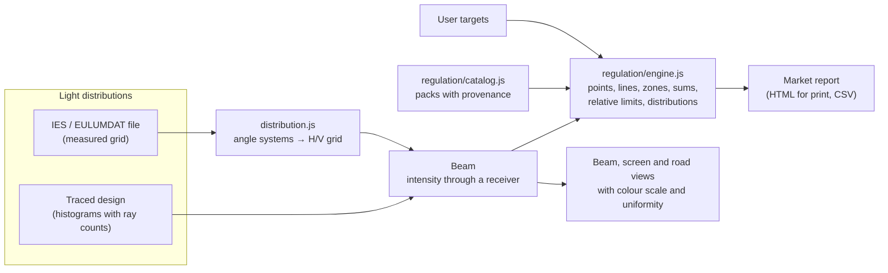

# Design: the photometry and installation workbench

This page records how Cutline grew from a headlamp designer into a lamp photometry workbench, and why it is built the
way it is. [ARCHITECTURE.md](../ARCHITECTURE.md) describes the code as it stands; this page explains the decisions
behind the parts added for the workbench.

## What a lighting engineer asked for

1. Open a measured or simulated light distribution (an IES file) and see it as **isolux and road ("isoroad")
   pictures**, with a colour scale they can change, to find uneven areas and dark patches.
2. A **report of how the lamp performs against several markets**: UN R149 for right- and left-hand traffic, UN R123
   (adaptive front lighting), FMVSS 108, CMVSS 108, China, Taiwan and India, plus **their own targets** at chosen
   measurement points, over and above the regulations.
3. The same for **signal lamps under UN R148**: for example, check that a direction indicator sends the right light
   in the right directions.
4. Open a **CAD model of the vehicle**, mark where each lamp sits, and check the **installation** against UN R48 and
   FMVSS 108.

## Shape of the solution

Cutline keeps one shell and gains three **workspaces**, each with its own document, ribbon, studies, views and
design panel:

| Workspace | Document | Answers |
|---|---|---|
| Lamp design | `cutline.design` (unchanged) | Design and trace a headlamp; check it against R149 |
| Photometry | `cutline.photometry` | Open an IES or EULUMDAT file (or the traced design); isolux, road and uniformity pictures; the market report; user targets; signal lamps |
| Vehicle | `cutline.vehicle` | Open a vehicle model; place each lamp; check R48 and FMVSS 108 installation |

The workspaces share the core: one way to read intensity, one regulation engine and one set of views.

### One way to read intensity

The R149 evaluator already reads a traced beam through a `Beam`: far-field histograms of lumens and ray counts, read
through the regulation's receiver. An imported file is resampled into the same histograms: each bin holds the file's
intensity at the bin centre times the bin's solid angle, and an infinite ray count, so its statistical error is zero.
Everything downstream (aiming, scans, measurement, the road, the display) then works unchanged on measured data, and
there is one measurement path to test.

The resampling is where the angle systems meet, so it is explicit. An IES file states its photometric type, and the
literature disagrees on how Types A and B are drawn. Cutline maps them as follows, documents it in
[PHYSICS.md](../PHYSICS.md#imported-light-distributions), and lets the user override it per file:

| File | Cutline reads it as |
|---|---|
| Type A (IES 3) | Horizontal angle is the azimuth about a vertical polar axis, vertical angle the elevation: the R149 goniometer, and Cutline's own frame |
| Type B (IES 2) | Vertical angle turns about a horizontal polar axis (left–right), horizontal angle is measured within that plane |
| Type C (IES 1), EULUMDAT | Vertical angle γ from the nadir, C-plane about the vertical; the lamp's axis is at γ = 90° in a chosen C-plane |

### Regulation packs

A **pack** is one regulation's requirements as data: its source, its provenance, and its functions (a beam class or a
signal function), each with an aiming rule, a coordinate tolerance and a list of requirements. The engine measures each
requirement kind the same way for every pack.

Every pack carries a **provenance**, shown in the app and the report:

| Provenance | Meaning |
|---|---|
| Official | Transcribed from the official text, every value cited |
| Adopted | The national text adopts another regulation; Cutline evaluates that regulation's data and names the series it stands on and the national differences it knows |

National rules that adopt UN regulations become **adopted** packs: the UN data plus the verified national
differences, never values filled in from memory. Taiwan's VSTD items state the UN series they adopt, and India's new
AIS drafts state theirs. China's GB 4599-2024 and GB 5920-2024 could not be tied to a UN series from an official
source, so Cutline lists them as not checked and says why; the same goes for India's older AIS-010 and AIS-012, which
stand on UN texts Cutline does not hold. The engineer's own targets are measured by the same engine and marked as
theirs. The research behind each pack is in `docs/research/`.

### Views and the colour scale

The beam view and the road view gain a **colour scale** the user controls: linear or logarithmic, a fixed range or
fitted to the data, a choice of palettes (light on a dark wall, heat, false colour for spotting unevenness, grey), and
user-set contour levels. The beam view can show intensity (cd) or illuminance on a flat screen at 25 m (lx). A
**uniformity** overlay shows each direction's intensity against its local average, so dark patches and stripes stand
out regardless of the beam's overall gradient, and the uniformity study lists the dips it finds.

The road view shows illuminance on the road surface (horizontal) or on a target facing the car (vertical), for one
lamp or a pair, at the mounting height, spacing and aim the user sets.

### Signal lamps

Signal functions use the same engine with requirement shapes of their own: the minimum and maximum on the reference
axis, a standard light distribution of test points set as percentages of the minimum, and fields where the intensity
must stay above a floor. Signal lamp coordinates are written with H positive outwards; the workspace mirrors them for
a lamp on the left of the vehicle.

### Vehicle installation

The vehicle workspace reads triangle meshes natively (STL, OBJ, glTF binary) with no dependencies. The user sets the
ground plane and the vehicle's axes, then places each lamp and outlines its apparent surface on the model. Each device
rule (count, height, width from the outer edge, separation, length position, angles of geometric visibility) is data
from the R48 and FMVSS 108 packs. Obstruction is checked by casting rays from the apparent surface across the
visibility angles against the vehicle mesh.

**STEP files.** Reading STEP needs a CAD kernel. The realistic browser option is OpenCascade compiled to WebAssembly:
LGPL-licensed, several megabytes, and it needs `'wasm-unsafe-eval'` in the Content Security Policy. That choice is the
project owner's to make; the vehicle workspace reads meshes through an importer interface, so a STEP importer can be
added without changing anything else. Until then, export the model from CAD as STL, OBJ or glTF.

## Status

| Part | State |
|---|---|
| IES (every LM-63 edition) and EULUMDAT import, Type A/B/C angle systems with overrides, export of a traced design as IES | Built and tested |
| Shared regulation engine; R149 01 runs on it unchanged | Built and tested |
| Photometry workspace: beam picture (cd or lx at 25 m) and road picture with user colour scales, uniformity map and dark patches, markets, targets, report and CSV | Built; covered by the browser test |
| Packs: UN R149 01 and 00, UN R123, FMVSS 108, CMVSS 108 (adopted), Taiwan VSTD 92, 92-1, 91, 91-1 (adopted), India AIS-199 and AIS-198 (adopted, drafts) | Built; transcription spot checks in `tests/packs.test.mjs` |
| Signal lamps: UN R148 01 and 00, FMVSS 108 Tables VI–XV, with conditions, standard light distributions and point rules | Built |
| China GB 4599-2024 and GB 5920-2024; India AIS-010 and AIS-012 | Not checked: listed with the reason (see REGULATION.md) |
| Vehicle workspace: STL, OBJ and glTF, sample vehicle, lamp placement, R48 and FMVSS 108 installation checks with ray-cast visibility, report | Built and tested |
| STEP import | Not built: needs a CAD kernel (OpenCascade compiled to WebAssembly, LGPL, several MB, a CSP change). The project owner's decision; the importer interface (`readMesh`) is where it would go |

### Known limits

- One light distribution per study: rules comparing two states of a lamp (stop to rear position ratios, a "D" lamp
  with a source failed, AFS modes measured with another mode's aim, R123's one-side rules) are listed, not judged.
- A lamp's apparent surface is a rectangle; R48's 60%-or-75 mm rule for lamps in parts, band lamps and the 12.5 cm²
  M1/N1 alternative are not modelled. Rules relative to the rear window or to other lamps are listed to check by hand.
- Type A and B conventions differ between sources; Cutline's default and the override are documented in PHYSICS.md.
